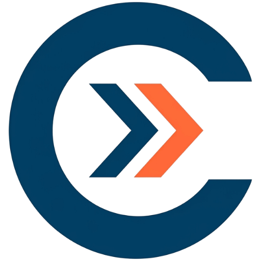

# Codeveer Digital Solutions

### 🏛️ Digital Architects for Indian Enterprises

---

> **"We don't just build websites; we architect digital growth."**

---

## 🏢 Who We Are

**Codeveer Digital Solutions** is an Indian digital agency on a mission to architect the digital future of Indian businesses. We are a team of **5+ passionate builders** — designers, developers, and strategists — united by a single goal: helping businesses own the digital landscape.

Founded and led by **Somveer Kumar** (Founder) and **Arun Kumar** (Co-Founder), each with 5+ years of hands-on experience, Codeveer bridges the gap between traditional business excellence and modern digital innovation.

We serve **150+ Indian businesses** across industries — from local startups to pan-India enterprises — delivering solutions that resonate with diverse audiences while maintaining global standards.

---

## 🎯 What We Do

We offer end-to-end digital services designed to scale your brand in the competitive Indian market:

### 🖥️ Web Design & Development
High-performance, localized web experiences built for conversion and speed.
- Full-Stack Development (React, Next.js, Node.js)
- WordPress Development — Custom themes & plugins
- UI/UX Web Design — Figma-to-code, pixel perfect
- E-Commerce Solutions (WooCommerce, Shopify & custom)
- Responsive & Mobile-First design
- API & Backend Integration (REST, GraphQL, third-party APIs)

### 📈 SEO & Content
Dominate search rankings with data-driven organic growth.
- Technical SEO Audits & Keyword Intelligence
- Content Authority & Backlink Architecture
- Blog & Article Writing, Video Scripts & Copywriting

### 📣 SM & Ads (Social Media & Advertising)
End-to-end social media management and precision-targeted ad campaigns.
- Social Media Strategy & Management
- PPC & Paid Ads across platforms
- Engagement & Growth Optimization
- Campaign Analytics & ROI Tracking

### 🤖 Business Automation
Scale your operations with intelligent, AI-powered automation.
- Chatbot Setup & Deployment
- Lead Automation & CRM Integration
- Workflow Optimization Systems

### 📸 AI Product Media
Stunning AI-powered visuals for e-commerce and marketing.
- AI Product Photography
- Video Ads Creation
- E-Commerce Ready Media Assets

---

## ✨ Our Signature Offering: 24-Hour Free Preview

Our differentiator? You **experience your future website before you commit**. We deliver a real, working prototype within 24 hours — zero cost, zero obligation. Just pure digital vision.

> Limited to **5 new previews per month** to maintain quality.

---

## 📊 By the Numbers

| Metric | Value |
|---|---|
| 📦 Projects Delivered | 500+ |
| 🤝 Client Retention Rate | 98% |
| 🏢 Indian Businesses Served | 150+ |
| 👥 Team Members | 5+ |

---

## 🚀 Coming Soon — AI-Powered Future

We're building the **next generation of AI tools** to supercharge brand digital presence:

- 🤖 **AI Social Content Posting** — Automated, intelligent content creation & scheduling across all platforms. Your brand stays active 24/7.
- 📊 **Smart Brand Analytics** — AI-driven sentiment analysis, competitor tracking, and growth recommendations.
- 🎨 **AI Content Studio** — Stunning product visuals, ad creatives, and multilingual video content generated in seconds.

> 🔴 **Building in public.** Follow us to be the first to know when these launch.

---

## 🏭 Industries We Serve

- ⚖️ Law Firms
- 🏥 Healthcare
- 🏠 Real Estate
- 🛒 E-Commerce
- 🎓 Education

---

## 💼 Our Portfolio

We have delivered winning digital experiences for clients across India. From fintech and hospitality to SaaS and e-commerce — our portfolio speaks volumes.

▶ **[View Our Work →](https://codeveer.in/portfolio)**

---

## 🌟 Why Codeveer?

| | |
|---|---|
| 🇮🇳 **Localization Experts** | We understand the Indian market — diverse audiences, regional nuances, and local preferences built into every UI/UX. |
| ⚡ **Performance First** | India-optimized sites. Fast-loading even on 4G/5G mobile connections across the subcontinent. |
| 🛡️ **Integrity First** | Transparent processes, honest pricing, and real advice — always. |
| 📞 **24/7 Strategic Support** | We're partners, not vendors. Real people, real solutions, in your time zone. |
| 📊 **Data Driven** | Every decision backed by rigorous data and real-time performance tracking. |

---

## 📬 Get In Touch

Ready to see your digital future?

| Channel | Link |
|---|---|
| 🌐 Website | [codeveer.in](https://codeveer.in) |
| 📧 Email | [hello.codeveer@gmail.com](mailto:hello.codeveer@gmail.com) |
| 💬 WhatsApp | [+91 8595594097](https://wa.me/918595594097) |
| 📞 Call | [+91 8595594097](tel:8595594097) |

---

**[🚀 Get Your Free 24-Hour Preview →](https://codeveer.in/free-preview)**

 

*© 2025 Codeveer Digital Solutions. Architecting India's Digital Future.*

